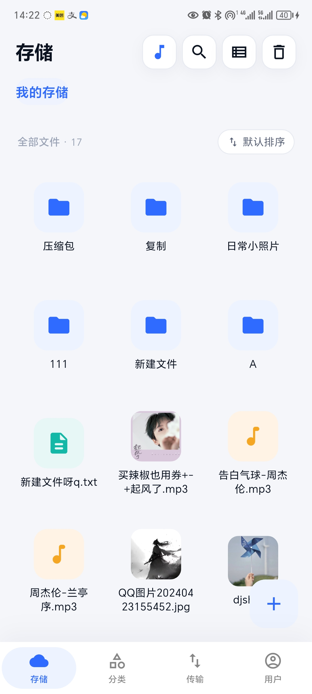
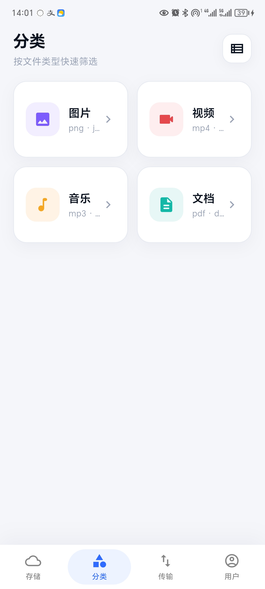
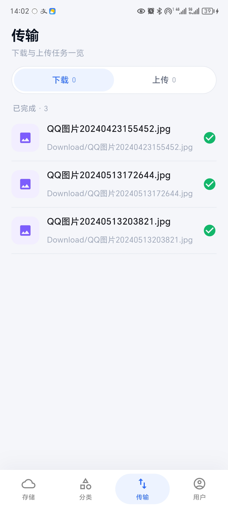
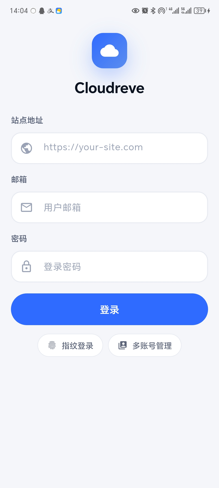
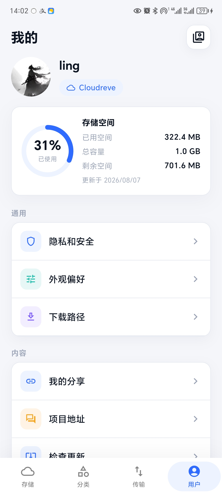
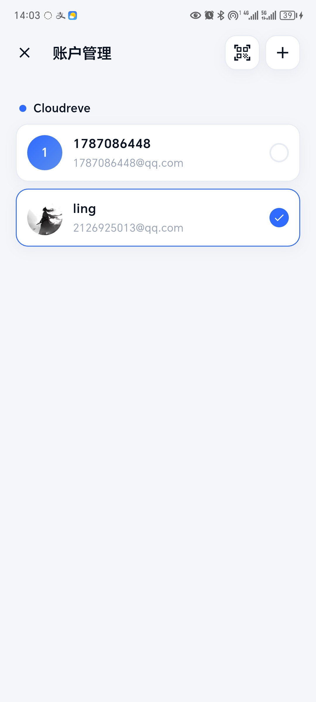
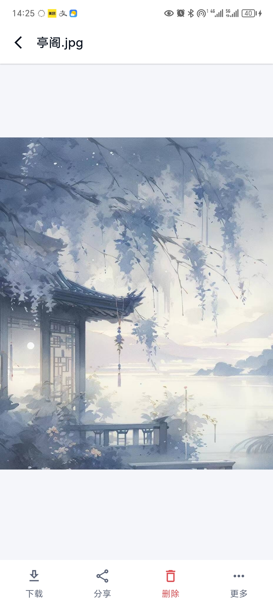
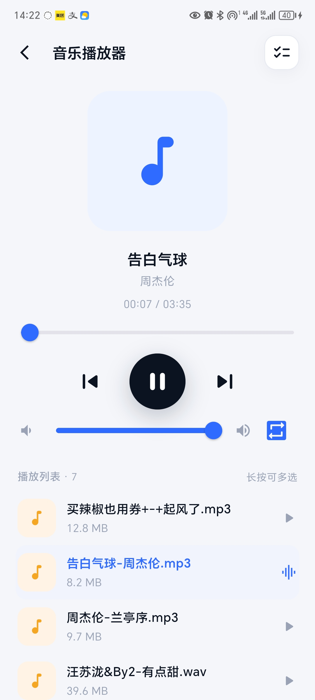

<div align="center">

# ☁️ 云阁 CloudPavilion

基于 **CloudReve V4 API** 的自托管云存储客户端，使用 Flutter 构建。

[](LICENSE)
[]()

</div>

云阁是 CloudReve 的第三方移动客户端，支持浏览、预览、播放、传输云端文件，
兼容标准认证头与自定义认证头的 Cloudreve 站点，多站点 / 多账号自由切换。

## 功能特性

- **文件管理**：目录浏览（列表 / 网格）、排序、面包屑导航、文件详情
- **批量操作**：多选下载、分享、删除、重命名、移动 / 复制
- **分类视图**：图片 / 视频 / 音乐 / 文档 四类快捷筛选
- **在线预览**：图片、视频、音频、文档在线预览
- **音乐播放**：后台播放、系统媒体通知栏控制、循环模式、封面缓存
- **传输管理**：上传 / 下载后台任务，失败可重试（中断任务重启后标记为失败）
- **回收站**：软删除、恢复、彻底删除、一键清空
- **我的分享**：创建 / 编辑 / 删除分享链接，复制分享地址
- **登录安全**：密码登录、指纹登录、多账号管理、token 自动续期
- **隐私安全**：修改密码、指纹登录账号管理
- **体验细节**：深色 / 浅色主题、缓存自动清理、版本更新检查

## 界面预览

| 存储页                       | 分类页                       | 传输页                       |
| ---------------------------- | ---------------------------- | ---------------------------- |
|  |  |  |

| 登录页                       | 用户页                       | 账户管理                         |
| ---------------------------- | ---------------------------- | -------------------------------- |
|  |  |  |

| 图片预览                             | 音乐播放器                           |
| ------------------------------------ | ------------------------------------ |
|  |  |

## 技术栈

- **框架**：Flutter / Dart
- **后端**：CloudReve V4 API（需自建 Cloudreve 服务）
- **音频**：just_audio + audio_service（后台音乐播放与媒体通知栏）
- **缓存**：flutter_cache_manager（缩略图 / 封面磁盘缓存）
- **安全**：flutter_secure_storage（凭据加密存储）、local_auth（生物识别登录）
- **网络**：dio（统一请求拦截、token 自动刷新）

## 环境要求

- Flutter 3.16+ / Dart 3.2+
- Android 7.0（API 24）及以上
- 自建的 Cloudreve 站点（V4 版本）

## 快速开始

```bash
git clone https://github.com/Miriy-been/cloud-pavilion.git
cd cloud-pavilion
flutter pub get
flutter run
```

在登录页输入站点地址、邮箱与密码即可使用；也可通过「多账号管理」在多个站点 / 账号间快速切换。

## 构建

```bash
flutter build apk --release
```

APK 输出于 `build/app/outputs/flutter-apk/`。

## 更新与发布

新版本通过 GitHub Releases 分发，用户可直接从 Releases 页面下载最新版本的 APK 文件。

## 已知限制

- 登录页暂不支持两步验证（2FA）
- 在线预览支持的文件类型有限

## 免责声明

- 本项目为 CloudReve 的**第三方客户端**，与 CloudReve 官方无任何关联，也不代表 CloudReve 官方的立场。
- 部分界面素材、图标、示例图片等可能来源于网络，版权归原作者所有；本项目仅用于学习交流，不用于任何商业用途。
- 如相关素材涉及侵权，请联系 [2126925013@qq.com](mailto:2126925013@qq.com)，我们将在核实后第一时间处理。
- 使用本项目连接任何站点所产生的数据与后果，由使用者自行承担；请遵守所连接站点的服务条款与当地法律法规。

## 开源协议

[MIT](LICENSE)
